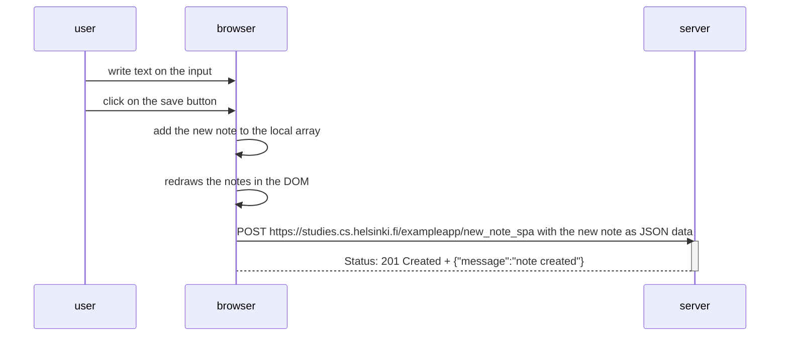

```mermaid

sequenceDiagram
    participant user
    participant browser
    participant server 
    
    user->>browser: write text on the input
    user->>browser: click on the save button
    browser->>browser: add the new note to the local array
    browser->>browser: redraws the notes in the DOM
    browser->>server: POST https://studies.cs.helsinki.fi/exampleapp/new_note_spa with the new note as JSON data
    activate server
    server --> browser: Status: 201 Created + {"message":"note created"}
    deactivate server


```